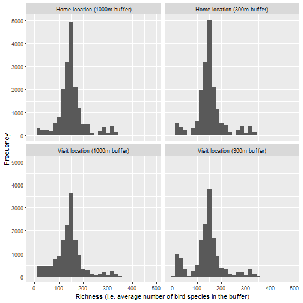

This readme explains the steps for appending globally-consistent birds species richness data to the BlueHealth International Survey data files using R. BlueHealth International Survey data files can be found [here](https://beta.ukdataservice.ac.uk/datacatalogue/studies/study?id=8874), but this tutorial uses the 18-country file internal to the University of Exeter users.

Appending this data will require a number of geographical and data manipulation packages:


```r
if (!require("pacman")) install.packages("pacman") # easy package management
pacman::p_load(rgdal, rgeos, raster, sp, tidyverse)
```

## Retrieving the birds species richness data

The birds species richness data used for this exercise was from Biopama and is retrievable [here](https://geonode-rris.biopama.org/layers/geonode:birds_richness_compressed#/). The compressed .tif raster file from the original data is contained in this repository.

To load this TIF file into the global environment, we can use the `raster()` function and save it as an object (note, your file path will be wherever the TIF is saved):


```r
birds <- raster("C:/Users/lre203/OneDrive - University of Exeter/20160301_BH/20160301_Survey/20170713_Data/Exposure Assessment/Bird Richness/birds_richness_compressed.TIF")
```

We can briefly view this data too with the `plot()` function:


```r
plot(birds)
```


Importantly, we can check the projection of the data:


```r
birds@crs
```

```
## CRS arguments: +proj=longlat +datum=WGS84 +no_defs
```

The nice thing is the projection is in standard WGS84, the same as our coordinates for home and visit locations in the BIS.

## Retrieving BIS data

I have the BIS data saved as an R workspace file which can be read in with the `load()` function:


```r
load("C:/Users/lre203/OneDrive - University of Exeter/20160301_BH/20160301_Survey/20170713_Data/Final Datasets/20200302_bis.RData")
```

We can view, for example, the home locations overlaid on the bird richness map using the `points()` function:


```r
points(bis$home_longitude, bis$home_latitude)
```

```
## Error in plot.xy(xy.coords(x, y), type = type, ...): plot.new has not been called yet
```

You can see the anomalous home locations which can/could be screened out using the flag variables in the BIS dataset is using this bird richness dataset.

## Preparing spatial points data frames

In order to prepare the data for extraction of bird species richness information, we need to turn the home and visit coordinates in BIS into spatial points data frames. Firstly, we make data frames which are just the corresponding coordinates and IDs using some `dplyr` functions:


```r
bis %>%
  select(id, home_longitude, home_latitude) %>%
  filter(across(everything(), ~!is.na(.))) -> bis_home_locations

bis %>%
  select(id, v_visit_lon, v_visit_lat) %>%
  filter(across(everything(), ~!is.na(.))) -> bis_visit_locations
```

Then we turn these into spatial points data frames using the `SpatialPointsDataFrame()` function from the `sp` package, ensiuring the longitude comes first and the latitude second:


```r
SpatialPointsDataFrame(bis_home_locations[,2:3],
                       proj4string = birds@crs,
                       data = bis_home_locations) -> bis_home_locations_spdf

SpatialPointsDataFrame(bis_visit_locations[,2:3],
                       proj4string = birds@crs,
                       data = bis_visit_locations) -> bis_visit_locations_spdf
```

## Extracting data

Now we have our home and visit location points data prepared, we can extract data from buffers around those points about the birds species richness. I have selected 300m and 1000m radial buffers in order to be consistent with the GlobeLand30 data already present in BIS. I have also selected the extraction function to get the average birds species richness value from the tiles that the buffer intersects (this is changeable e.g. maxima, minima etc.). Given the resolution of the birds species richness data is 1km x 1km, the 300m buffers won't often intersect multiple tiles anyway, and I expect the 300m and 1km data will end up looking similar. It's also worth noting that the buffers around the visit coordinate are slightly arbitrary as the point represents the place they "arrived at" - in other words we do not know much about how far around/from that point they roamed. Anyway, the four sets of data can be retrieved using the `extract()` function from the `raster` package:


```r
raster::extract(birds, # the raster dataset
                bis_home_locations_spdf, # the spatial points data frame with home locations
                buffer=300, # 300m buffer around the point
                fun=mean, # extract the mean value of birds species from the pixels which the buffer intersects
                df=TRUE) %>% # return a data.frame
  bind_cols(bis_home_locations$id) %>% # join the original participant IDs
  select(home_bird_richness_300=birds_richness_compressed, id=`...3`) -> bis_home_locations_birds_300

raster::extract(birds,
                bis_home_locations_spdf, 
                buffer=1000, # 1000m buffer around the point
                fun=mean, 
                df=TRUE) %>% 
  bind_cols(bis_home_locations$id) %>%
  select(home_bird_richness_1000=birds_richness_compressed, id=`...3`) -> bis_home_locations_birds_1000

raster::extract(birds, 
                bis_visit_locations_spdf, # the spatial points data frame with visit locations
                buffer=300, 
                fun=mean, 
                df=TRUE) %>% 
  bind_cols(bis_visit_locations$id) %>%
  select(v_bird_richness_300=birds_richness_compressed, id=`...3`) -> bis_visit_locations_birds_300

raster::extract(birds,
                bis_visit_locations_spdf, 
                buffer=1000, # 1000m buffer around the point
                fun=mean, 
                df=TRUE) %>% 
  bind_cols(bis_visit_locations$id) %>%
  select(v_bird_richness_1000=birds_richness_compressed, id=`...3`) -> bis_visit_locations_birds_1000
```

Now we have the data, these can be joined to the original bis dataset:


```r
bis %>%
  left_join(bis_home_locations_birds_300, by="id") %>%
  left_join(bis_home_locations_birds_1000, by="id") %>%
  left_join(bis_visit_locations_birds_300, by="id") %>%
  left_join(bis_visit_locations_birds_1000, by="id") -> bis
```

## Summarising and exploring the data

We can summarise each of the new variables:


```r
bis %>%
  select(home_bird_richness_300:v_bird_richness_1000) %>%
  map(~summary(.))
```

```
## $home_bird_richness_300
##    Min. 1st Qu.  Median    Mean 3rd Qu.    Max.    NA's 
##     1.0   129.0   148.0   152.4   167.0   369.0     929 
## 
## $home_bird_richness_1000
##    Min. 1st Qu.  Median    Mean 3rd Qu.    Max.    NA's 
##     1.0   127.0   147.7   151.7   166.0   369.0     929 
## 
## $v_bird_richness_300
##    Min. 1st Qu.  Median    Mean 3rd Qu.    Max.    NA's 
##     2.0   118.0   146.0   140.9   164.0   485.0    3873 
## 
## $v_bird_richness_1000
##    Min. 1st Qu.  Median    Mean 3rd Qu.    Max.    NA's 
##     2.0   111.7   143.0   139.4   161.0   487.0    3873
```

And generate some histograms:


```r
bis %>%
  pivot_longer(cols = home_bird_richness_300:v_bird_richness_1000,
               names_to = "bird",
               values_to = "richness") %>%
  mutate(bird2 = fct_recode(bird,
                            "Home location (300m buffer)"="home_bird_richness_300",
                            "Home location (1000m buffer)"="home_bird_richness_1000",
                            "Visit location (300m buffer)"="v_bird_richness_300",
                            "Visit location (1000m buffer)"="v_bird_richness_1000")) %>%
  ggplot(aes(x=richness)) +
  geom_histogram() +
  facet_wrap(~bird2) +
  scale_x_continuous(name="Richness (i.e. average number of bird species in the buffer)") +
  scale_y_continuous(name="Frequency")
```

```
## `stat_bin()` using `bins = 30`. Pick better value with `binwidth`.
```

```
## Warning: Removed 9604 rows containing non-finite values (stat_bin).
```



After that the world is your oyster (or bird):

  - Greener areas are more bird species rich:
  

```r
pacman::p_load(sjPlot)
lm(green_space_1000_pct ~ home_bird_richness_1000, data=bis) %>% sjPlot::plot_model(type="pred")
```

```
## $home_bird_richness_1000
```


  
  - But more bird rich areas are associated with _lower_ life satisfaction:
  

```r
lm(lifesat ~ home_bird_richness_1000, data=bis) %>% sjPlot::plot_model(type="pred")
```

```
## $home_bird_richness_1000
```


  
## END
